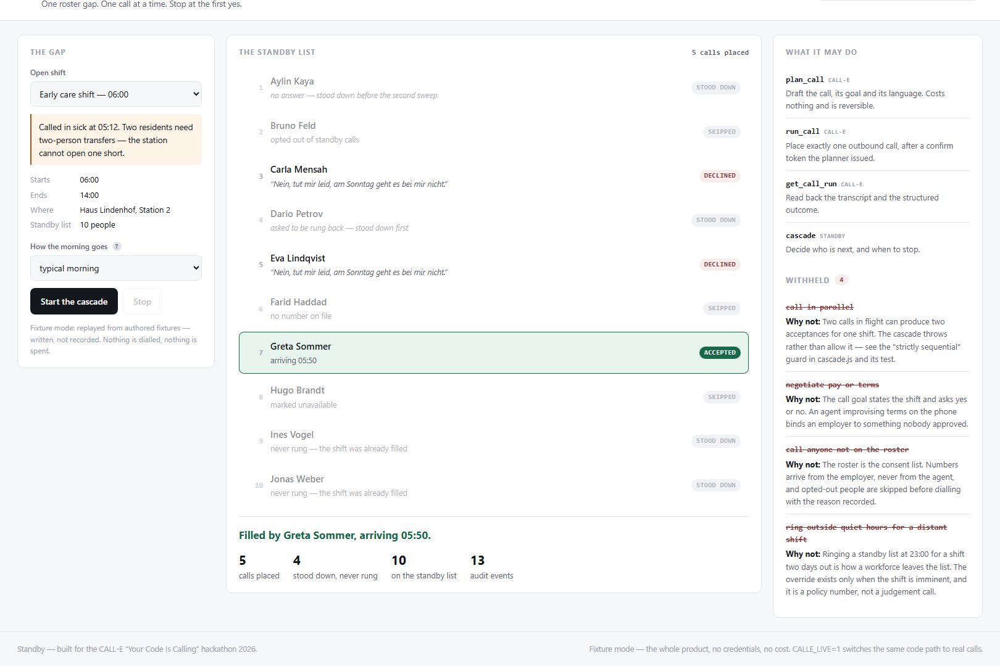

# Standby

**One roster gap. One call at a time. Stop at the first yes.**

No CALL-E account? The entire product runs offline:

```bash
npm start          # then open http://localhost:3000
```

There is nothing to install — zero npm dependencies — and nothing to sign up
for. Fixture mode replays authored CALL-E responses through the same code that
places live ones.

```bash
npm test           # 63 assertions, no phone, no network, two seconds
CALLE_LIVE=1 npm start   # the same code path against real calls
```

---

## The problem

05:40. A care home, a restaurant, a depot is one person short. A supervisor now
picks up the phone and works down a list of twenty casual staff, one at a time,
until somebody says yes.

It has to be one at a time. Ring all twenty and four of them say yes, and now
somebody has to un-invite three people who have already got out of bed — worse
for them than never being called, and the fastest way to empty a standby list.
So it is sequential, it is time-critical, it happens before dawn, and there is
no email substitute: whoever is asleep at 05:40 is not reading email, but they
will answer a ringing phone.

That is a cascade, not a campaign. It is why a human still does this by hand.

## What Standby does

One trigger — a gap in the roster — and the agent works the standby list in the
order the employer gave it, one call in flight, stopping the moment somebody
accepts.



Five calls placed. Four people never rung. One shift filled.

## The parts that are not a loop

A `for` loop over twenty numbers takes an afternoon to write. These are the
rules that make it a system, and each one is asserted in `npm test`:

| | |
|---|---|
| **One call in flight, ever** | Enforced, not advised. A second concurrent call raises an error. Two in flight can produce two acceptances for one shift. |
| **Stop on the first accept** | Everyone still queued is explicitly *stood down* and recorded as such — not left dangling as "queued", which in a log is indistinguishable from a crash. |
| **No-answer gets one retry, at the end** | Never an immediate redial. Ringing someone twice inside a minute at 05:40 is how people leave a standby list. Nobody is rung a third time. |
| **Callbacks are honoured once** | "Ring me back at ten past" requeues them for then, ahead of untried names — they have already half-agreed. A second callback request is a polite decline. |
| **Quiet hours, with an override that has a number on it** | 22:00–05:00 by default. Overridden only when the shift starts within ninety minutes, because a 06:00 shift is exactly when you *do* ring at 05:40. Policy, not a judgement the agent makes on the call. |
| **A wall clock** | The shift starts whether or not the list is exhausted. Past the cutoff, dialling stops. |
| **A late yes is not a clean fill** | "I can be there by eight" for a 06:00 shift still stops the cascade — a second person arriving mid-shift is worse — but it is reported as *120 minutes into the shift, the gap is covered, not closed*. |
| **An answer nobody could read stops everything** | Not a decline. The cascade halts, nobody else is rung, and a person says what the call meant — by name, in the log. |

## Reading the answer

**Anything that is not a clear yes is not a yes** — and anything that is not
clear at all is not a no either. Three outcomes, not two.

The trap worth naming first: *"Sorry, I can't take it today"* contains the word
"can". A naive yes-check reads that as an acceptance and the station opens one
short. Refusal markers are tested before agreement markers, in the shift's
language and in English, and only against what the **callee** said — the agent's
own script says "Ja, gerne" in nearly every call.

The correction that matters more, because it hid behind a flag:

| Getting it wrong | What it costs |
|---|---|
| A false **acceptance** | Ends the cascade. Shift unfilled, everyone stood down, discovered at 06:00. |
| A false **decline** | Passes over someone who was willing, and rings the next person about a shift that may already be taken. Leaves no trace. |
| A **hold** for a person | Thirty seconds of a supervisor's attention. |

An unreadable call used to be recorded as a decline with an `unparsed` flag
beside it. The flag was honest and the behaviour was not: a decline *advances*
the cascade, so operationally an unreadable call was a no. It now **stops** the
cascade. Nobody further down the list is rung — attempting it raises an error,
the same way a second concurrent call does — nobody is stood down, and the
roster waits exactly where it is until a person records what the call meant.
That resolution carries their name, has to be a real outcome rather than another
hold, and lands in precisely the state the classifier would have produced.

Held on: nothing decidable; a summary containing a refusal *and* an agreement;
an agreement the run itself does not mark completed; a lone "ja" in a transcript
with nothing corroborating it.

## What the agent is not allowed to do

Standby telephones real people about work, early in the morning. The dashboard
states the withheld capabilities on its own front page:

- **Call in parallel.** The one that would double-book the shift.
- **Negotiate pay or terms.** The goal states the shift and asks yes or no. An
  agent improvising terms binds an employer to something nobody approved, and
  the person on the phone cannot tell a machine just invented it.
- **Call anyone not on the roster.** The roster is the consent list. Numbers
  come from the employer, never from the agent. Opted-out people are skipped
  *before* dialling and the reason is recorded — a silent skip is
  indistinguishable from a bug.
- **Ring outside quiet hours for a distant shift.**

## How it is built

```
server/cascade.js    the state machine — no I/O, no clock, no network
server/calle.js      the phone, behind one interface with two backings
server/runner.js     the loop between them; holds no rules of its own
server/index.js      HTTP + server-sent events, no dependencies
skills/standby/      the Agent Skill, for CALL-E's skill catalogue
fixtures/calls/      authored CALL-E responses, replayed in fixture mode
```

`scripts/make-fixtures.mjs` writes the fixtures. `scripts/capture-call.mjs`
places one real call for checking the live path by hand; it writes to a
git-ignored directory and cannot write into `fixtures/`.

`cascade.js` is a reducer: hand it a state and an event, get the next state.
Every decision — who is next, whether to wait, when to stop — is a pure
function of state and clock, so the interesting behaviour is provable in
milliseconds without spending one of twenty free calls. The runner contains no
rules at all; it asks `nextAction` and does what it is told, which is why the
behaviour in the tests is the behaviour in production.

The event log **is** the state: replay the events into a fresh cascade and you
get the same summary, including how it ended. That is asserted too.

## Fixture mode, and why it is the point

A judge cannot reproduce a phone call.

Most entries built on a calling API ship a repo that only works if the reviewer
signs up, gets a number, and spends their own free calls. So most reviewers read
the README and watch the video.

Fixture mode replays **five authored CALL-E responses**: a yes with an arrival
time, a no, a "ring me back in twenty minutes", one that reached voicemail, and
one that dropped mid-sentence and cannot be read at all. The whole cascade —
every state, the stop condition, and the hold — can be watched, clicked through
and read end to end with no account. `CALLE_LIVE=1` switches the same code path
to real calls.

The fixtures are **written, not recorded.** `scripts/make-fixtures.mjs` produces
them, `npm test` runs it in `--check` mode, so the files on disk are provably
that generator's output — regenerate and diff rather than taking "synthetic" on
trust.

An earlier version of this repository shipped four genuine captures instead:
real German transcripts, real provider run and call identifiers, and screenshots
of them. They were placed to a consenting number and the number was scrubbed on
the way to disk. That was not enough. A transcript is a recording of a person
speaking, and agreeing to take one call is not agreeing to be published and
cloned indefinitely.

What that costs, stated plainly: a capture breaks loudly if CALL-E changes its
response shape, and an authored fixture cannot — it agrees with itself for ever.
Shape drift is now caught only by `CALLE_LIVE=1` against the live API. The trade
is the right way round.

Scenarios in the dashboard pick which outcome stands in for each call, so a
ten-person cascade can be demonstrated honestly without placing ten real calls:
`typical-morning`, `first-pick`, `second-sweep`, `callback-wins`,
`nobody-available`, `unreadable-call`.

## Phone numbers

Every number in this repository is inside a range a regulator or a network
operator has **permanently withheld from allocation** — not a range that merely
looks unused:

| Range | Withheld by |
|---|---|
| `+49 176 040690 00`–`99`, `+49 171 39200 00`–`99` | German mobile network operators, for media use |
| `+49 30 23125 000`–`999` and four other city blocks | Bundesnetzagentur, for film and television |
| `+44 7700 900000`–`900999` | Ofcom, drama range |
| `+1 NPA 555 0100`–`0199` | NANPA, fictional use |

`npm test` runs `scripts/test-numbers.mjs`, which scans every file in the
repository — prose included — and fails on any number outside those ranges.
Numbers are also masked wherever they leave the process.

This is checked mechanically because reading carefully did not work. Two numbers
got into this repository that should not have: a real German mobile sitting in a
test file as a negative assertion — a line checking that the number did *not*
appear in the fixtures, which published it on the line doing the checking — and
a demo roster built on a live mobile prefix with a run of zeroes behind it,
chosen because it looks obviously fake. **"Looks fake" is not a property a phone
number has.**

## The Agent Skill

`skills/standby/` packages the cascade as a portable Agent Skill for CALL-E's
`plan_call` / `run_call` / `get_call_run` tools, with its rules, its safety
constraints and worked examples as references. It passes
`scripts/validate_repository.py` in
[awesome-phone-call-agents](https://github.com/CALLE-AI/awesome-phone-call-agents).

## Licence

MIT.
